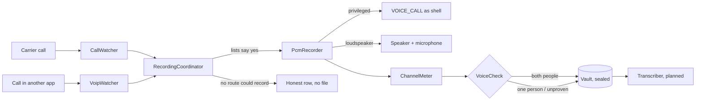

# Architecture

Module map and data flow for the Android app. The capture chain, the lists and
the vault exist; the modules marked **planned** are designed but unwritten. Each
built module has its reasoning in [app/__about/](../app/___app.md).

Navigation: [README](../README.md) · [PLAN](PLAN.md) · [FEATURES](FEATURES.md)

---

## Modules

| Module | Responsibility | Key platform pieces |
|--------|----------------|---------------------|
| **CallWatcher** | Notices a carrier call starting and ending. Refuses to register without the permission, and says so, rather than dying inside a service callback. | `TelephonyCallback`, `PhoneStateListener` below API 31 |
| **VoipWatcher** | Notices a conversation no telephony API reports — invisible to telephony, visible in the audio mode. Holds no app list, so it covers every calling app and can name none. | `AudioManager.OnModeChangedListener` |
| **CallIdentity** | Who was on the other end and who called whom, read back from the call log because Android 12 stopped telling listeners. | `CallLog.Calls`, `PhoneLookup` |
| **RecordingCoordinator** | Chooses a route, applies the lists (twice — the number usually arrives late), seals, files. One conversation in, one row out. | — |
| **PcmRecorder** | The one recording engine: stereo before mono, a ladder of sources, measured while written. Hosted by two processes. | `AudioRecord` |
| **PrivilegedRecorder** | That engine inside the process Shizuku spawns as the ADB shell — the only one that may open the call's own audio. | Shizuku `UserService`, AIDL, `VOICE_CALL` |
| **MicRecorder** | That engine inside the app, with the loudspeaker on. Measured 2026-09-24: silenced by Android for the whole of a call, so it records nothing ([STATUS](STATUS.md)). | `setCommunicationDevice`, `UNPROCESSED`/`MIC` |
| **ChannelMeter / VoiceCheck** | Measure the stream per channel and over time, then decide whether two PEOPLE are in the file. The only writer of `Quality`. | — |
| **RouteMemory** | What the guided test call proved about each route ON THIS PHONE, and which routes the user switched on. | DataStore |
| **Vault** | Encrypted storage of recordings + transcripts, hash + timestamp seal at creation, Room index. | Jetpack Security, Room |
| **RecordingPolicy** | Record/skip decisions per number; record-everything default. | — |
| **RuntimePermissions** | Every permission the app must be GIVEN, why, and whether it was — rendered as steps in the one guided list. | — |
| **Guard** *(planned)* | PIN/biometric gate; an alternative neutral name + icon chosen with one tap; nothing leaked to gallery/recents/share sheets. | BiometricPrompt, activity-alias per look |
| **Transcriber** *(planned)* | After the call, never live: audio → text with timestamps, then speaker labels. On a stereo recording the labels are exact, because the device already separated the speakers. | whisper.cpp via JNI |
| **SOS** *(planned, M4)* | Always-listening danger-phrase recognition; on match, an automatic location alert with a short cancel window. | Picovoice Porcupine, fused location |

## Data flow

Nothing here leaves the device. The only bytes that ever will are a copy the
user explicitly shares and, later, the SOS alert.

## Rules with teeth

- Recordings land ONLY in the Vault — never in shared storage, never as a plain
  file. The seal happens at file close, before anything else may read it. The
  plaintext copy the recorder writes into the cache is deleted in the same
  breath as the seal is taken.
- `VoiceCheck` is the only writer of `Quality`, and it decides from a
  measurement. Loudness is not a measurement of who is speaking.
- A route may not be called protection until the guided test call proved it on
  that phone. Untested is `NEEDS_TEST`, measured-one-sided is `PROVEN_HALF`, and
  neither is drawn as "recording is on".
- The privileged process writes into a descriptor the APP opened, so nothing
  privileged ever touches app-private storage itself.
- Every module obeys the INSPECTION TEST and PRIVACY laws in [CLAUDE.md](../CLAUDE.md).

## Technology choice

Native Kotlin + Jetpack Compose; the full Step-3 justification (with Flutter,
React Native and C# MAUI considered and rejected) lives in
[CLAUDE.md](../CLAUDE.md) → Stack.
