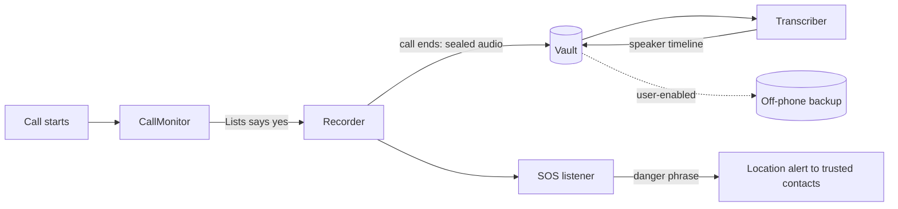

# Architecture

Module map and data flow for the Android app. No product code exists yet —
this is the founding sketch; each module becomes a folder with its own
`___folder.md` + `__about/` docs the day its first file lands.

Navigation: [README](../README.md) · [PLAN](PLAN.md) · [FEATURES](FEATURES.md)

---

## Modules

| Module | Responsibility | Key platform pieces |
|--------|----------------|---------------------|
| **CallMonitor** | Notices a call starting/ending, asks Lists whether this one is recorded, starts/stops Recorder. | `TelephonyCallback`, foreground service (`microphone` type) |
| **Recorder** | Captures the microphone into one sealed audio file per call. Detects the muted-mic case and reports it honestly. | `AudioRecord`/`MediaRecorder` (MIC source only) |
| **Transcriber** | After the call (never live): audio → text with per-segment timestamps, then diarization → speaker labels. Runs on-device. | whisper.cpp via JNI; lightweight diarization |
| **Vault** | Encrypted storage of recordings + transcripts, hash + timestamp seal at creation, Room index, optional off-phone copy. | Jetpack Security, Room |
| **Lists** | Record/skip decisions per number; record-everything default. | `READ_CALL_LOG` (declared) |
| **Guard** | PIN/biometric gate, neutral name/icon (activity-alias), nothing leaked to gallery/recents/share sheets. | BiometricPrompt, activity-alias |
| **SOS** (M4) | Always-listening danger-phrase recognition during calls; on match, automatic location alert to trusted contacts with a short cancel window. | Picovoice Porcupine (on-device), fused location |

## Data flow

Everything left of the dotted line lives and dies on the device; the only
bytes that ever leave it are the user-enabled backup and the SOS alert.

## Rules with teeth

- Recorder writes ONLY into Vault — never to shared storage, never a plain
  file. The seal (hash + timestamp) happens at file close, before anything
  else may read it.
- Transcriber runs post-call and on-device; a cloud STT path, if ever added,
  is opt-in behind its own consent screen and its own setting.
- SOS recognition runs on-device; the phrase model never leaves the phone.
- Every module obeys the INSPECTION TEST and PRIVACY laws in [CLAUDE.md](../CLAUDE.md).

## Technology choice

Native Kotlin + Jetpack Compose; the full Step-3 justification (with Flutter,
React Native and C# MAUI considered and rejected) lives in
[CLAUDE.md](../CLAUDE.md) → Stack.
